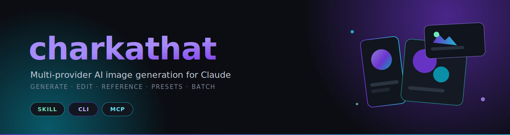
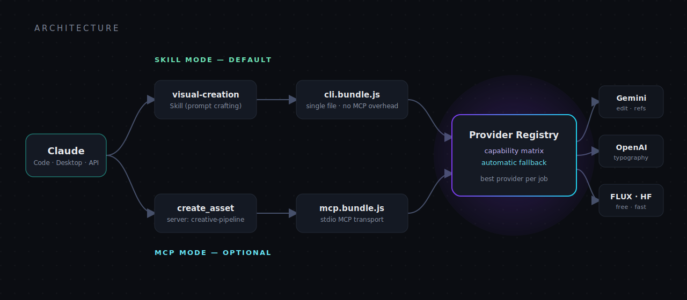

<p align="center">
  
</p>

<p align="center">
  
  
  
  
  
</p>

<p align="center">
  <a href="README.md">English</a>&nbsp;&nbsp;·&nbsp;&nbsp;<b>ไทย</b>
</p>

<p align="center">
  <b>อินเทอร์เฟซเดียว เลือกโมเดลภาพที่ดีที่สุดให้ทุกงาน</b><br>
  charkathat จะส่งงานแต่ละครั้งไปยังผู้ให้บริการที่เหมาะสมที่สุดที่ตั้งค่าไว้ และสลับไปตัวถัดไปอัตโนมัติเมื่อมีปัญหา —<br>
  พี่แค่บอกว่าต้องการภาพแบบไหน แล้วรับภาพที่เสร็จสมบูรณ์กลับมา
</p>

---

## ภาพรวม

charkathat คือชุดเครื่องมือสร้างภาพสำหรับ Claude ที่มาในสองรูปแบบจากโค้ดเบสเดียว: **Skill** ที่เรียกใช้ **CLI** แบบ bundle และ **MCP server** (ตัวเลือกเสริม) โดยพูดคุยกับผู้ให้บริการภาพหลายเจ้า — Google Gemini, OpenAI และ HuggingFace FLUX — ผ่านเลเยอร์ที่รู้จัก "ความสามารถ" ของแต่ละเจ้า ทำให้ Claude เลือกโมเดลที่เหมาะกับงานได้เอง แทนที่จะผูกติดกับผู้ให้บริการรายเดียว

ระบบถูกออกแบบมาให้ "กลมกลืน" ไปกับการทำงาน เมื่อ Claude กำลังสร้างหน้า landing page, สไลด์นำเสนอ หรือไอคอนแอป แล้วต้องการภาพ ตัว Skill จะตรวจจับความต้องการนั้น เขียน prompt ที่ดี เลือกอัตราส่วนภาพและผู้ให้บริการ แล้วสร้างไฟล์ไว้ในตำแหน่งที่ถูกต้อง — โดยไม่ต้องมานั่งสั่งเครื่องมือเอง

## ความสามารถ

| ความสามารถ | ทำอะไร |
|------------|--------|
| **เลือกผู้ให้บริการอัตโนมัติ** | ตาราง capability matrix ให้คะแนนผู้ให้บริการที่ตั้งค่าไว้ทุกตัวตามลักษณะงาน (แก้ภาพ, ภาพอ้างอิง, ตัวอักษร, ความเร็ว, ต้นทุน) แล้วส่งไปยังตัวที่เหมาะที่สุด |
| **สลับสำรองเมื่อล้มเหลว (fallback)** | ถ้าผู้ให้บริการ error, timeout หรือติด rate-limit ระบบจะลองตัวถัดไปในลำดับให้อัตโนมัติ |
| **แก้ไขภาพ** | แก้ภาพที่มีอยู่ด้วยคำสั่งข้อความ พร้อมแนบภาพอ้างอิงเพื่อคงสไตล์เดิมได้ |
| **ภาพอ้างอิง (reference)** | ส่งภาพอ้างอิงได้สูงสุด 13 ภาพเพื่อคงลุคให้สม่ำเสมอทั้งชุด (Gemini multimodal) |
| **พรีเซ็ตและเทมเพลตสไตล์** | เทมเพลต prompt แบบ Markdown ที่นำกลับมาใช้ซ้ำได้ (`hero`, `logo`, `thumbnail`, `icon` หรือสร้างเอง) พร้อมช่อง `{subject}` เพื่อความสม่ำเสมอของแบรนด์ |
| **เสริมคุณภาพ prompt** | Claude ขัดเกลา prompt ภายใน Skill และมี `--enhance` แบบกำหนดกฎตายตัวสำหรับเพิ่มตัวช่วยด้านคุณภาพเมื่อเรียกผ่าน CLI/MCP ตรงๆ |
| **สร้างเป็นชุด + แกลเลอรี** | สร้างหลายแบบในครั้งเดียว พร้อมไฟล์ HTML แกลเลอรีในตัว และไฟล์ `history.json` บันทึก prompt, ผู้ให้บริการ และโมเดลทุกครั้ง |
| **แจกจ่ายไฟล์เดียว** | esbuild รวมเป็นไฟล์เดียวต่อหนึ่ง entry point — ผู้ใช้ไม่ต้องติดตั้ง dependency ใดๆ |

## สถาปัตยกรรม

<p align="center">
  
</p>

ทั้งสอง entry point — CLI แบบ bundle และ MCP server — ใช้ core เดียวกัน ตัว CLI เป็นเส้นทางหลักของ Skill เพราะเลี่ยง overhead ของโปรโตคอล MCP ส่วน MCP server มีไว้สำหรับไคลเอนต์ที่ไม่ได้ใช้ Skill

**เรื่องการตั้งชื่อ** MCP server ใช้ชื่อ `creative-pipeline` และ tool ชื่อ `create_asset` ซึ่งจงใจให้กำกวม เพราะเมื่อชื่อ tool ตรงกับเจตนามากเกินไป (เช่น `generate_image`) ผู้ช่วย AI มักจะเรียก tool นั้นตรงๆ และข้ามชั้น Skill ไป — ทำให้เสียส่วนที่ Skill ช่วยเขียน prompt, เลือกอัตราส่วน และเลือกผู้ให้บริการ การใช้ชื่อกลางๆ จึงทำให้ Skill ยังเป็นตัวเลือกที่ชัดเจนสำหรับงานภาพ ขณะที่ตัว tool ก็ยังเรียกใช้ได้เมื่อจำเป็นจริงๆ

## การติดตั้ง

ใน Claude Code:

```
/plugin marketplace add ksmaster03/charkathat
/plugin install charkathat@charkathat
```

จากนั้นตั้งค่า API key ของผู้ให้บริการอย่างน้อยหนึ่งเจ้า:

```bash
mkdir -p ~/.config/charkathat
echo "GEMINI_API_KEY=your_key_here" > ~/.config/charkathat/.env
```

| ตัวแปร | ผู้ให้บริการ | หมายเหตุ | ขอ key ได้ที่ |
|--------|-------------|----------|----------------|
| `GEMINI_API_KEY` | Google Gemini | รองรับแก้ภาพ + ภาพอ้างอิง แนะนำให้ใช้ | https://aistudio.google.com/apikey |
| `OPENAI_API_KEY` | OpenAI (gpt-image-1) | เด่นเรื่องตัวอักษร / โลโก้ | https://platform.openai.com/api-keys |
| `HF_TOKEN` | HuggingFace (FLUX.1-schnell) | ฟรี เร็ว เหมาะกับงานร่าง | https://huggingface.co/settings/tokens |

รัน `charkathat --list-providers` เพื่อดูว่าผู้ให้บริการตัวไหนพร้อมใช้งานบ้าง

## การใช้งาน CLI

ทุกครั้งที่เรียก จะพิมพ์ผลลัพธ์เป็น JSON บรรทัดเดียวออกทาง stdout เช่น `{"success":true,"filePath":"...","provider":"gemini","aspectRatio":"16:9"}`

```bash
# สร้างภาพพื้นฐาน
charkathat -p "a red fox in fresh snow, cinematic lighting" -a 16:9 -o hero.png

# บังคับเลือกผู้ให้บริการ (ปกติไม่จำเป็น — ระบบเลือกให้ดีอยู่แล้ว)
charkathat -p "logo with the text ACME" --provider openai

# แก้ไขภาพที่มีอยู่
charkathat -p "change the background to a warm sunset" --edit photo.png

# คงสไตล์ให้สม่ำเสมอด้วยภาพอ้างอิง
charkathat -p "a matching coffee-cup icon" --ref icon1.png --ref icon2.png -o coffee.png

# ใช้พรีเซ็ตสไตล์
charkathat -p "a rocket ship" \
  --style skills/visual-creation/references/presets/icon.md

# สร้าง 4 แบบ + แกลเลอรี HTML
charkathat -p "modern budgeting app icon" -n 4 --gallery

# ดูผู้ให้บริการที่ตั้งค่าไว้และความสามารถ
charkathat --list-providers
```

| แฟลก | หน้าที่ |
|------|---------|
| `-p, --prompt` | คำอธิบายภาพ (จำเป็น) |
| `-o, --output` | พาธไฟล์ผลลัพธ์ (พาธสัมพัทธ์อิงกับ `--cwd` / รากของโปรเจกต์) |
| `-a, --aspect-ratio` | `1:1 16:9 9:16 4:3 3:4 4:5 5:4 3:2 2:3 21:9` (ค่าเริ่มต้น `1:1`) |
| `--provider` | บังคับใช้ `gemini` \| `openai` \| `huggingface` |
| `--edit <path>` | แก้ไขภาพที่มีอยู่ |
| `--ref <path>` | ภาพอ้างอิง (ใส่ซ้ำได้หลายภาพ) |
| `-s, --style <file>` | ใช้เทมเพลตสไตล์ Markdown |
| `--enhance` | เพิ่มตัวช่วยด้านคุณภาพแบบกำหนดกฎตายตัว |
| `-n, --count <1-4>` | จำนวนแบบที่ต้องการ |
| `--gallery` | สร้าง/อัปเดตแกลเลอรี HTML + ประวัติ |

## การเลือกผู้ให้บริการ

charkathat เลือกผู้ให้บริการที่ **ตั้งค่าไว้** และเหมาะที่สุดต่องานให้อัตโนมัติ จะบังคับเองก็ต่อเมื่องานนั้นเหมาะกับเจ้าใดเจ้าหนึ่งชัดเจน

| ผู้ให้บริการ | แก้ภาพ | ภาพอ้างอิง | ต้นทุน | ความเร็ว | เด่นด้าน |
|-------------|:------:|:----------:|:------:|:--------:|---------|
| Google Gemini | ได้ | สูงสุด 13 | มาตรฐาน | ปานกลาง | แก้ภาพ, คงสไตล์ด้วยภาพอ้างอิง, ภาพเหมือนจริง, อาร์ต |
| OpenAI (gpt-image-1) | ได้ | สูงสุด 4 | มาตรฐาน | ปานกลาง | ตัวอักษร, ข้อความในภาพ, โลโก้ |
| HuggingFace (FLUX.1-schnell) | ไม่ได้ | ไม่ได้ | ฟรี | เร็ว | งานร่างเร็วๆ, ทดลองซ้ำหลายรอบ |

ตารางความสามารถฉบับเต็มและคำแนะนำการบังคับเลือก อยู่ที่ [`skills/visual-creation/references/provider-guide.md`](skills/visual-creation/references/provider-guide.md)

## Build จาก source

```bash
cd core
npm install
npm run build      # typecheck แล้ว bundle เป็น cli.bundle.js และ mcp.bundle.js
```

เรียก CLI แบบ standalone ได้โดยตรง:

```bash
GEMINI_API_KEY=... node core/build/cli.bundle.js \
  --prompt "Landing page hero for a fintech startup" --aspect-ratio 16:9
```

## โครงสร้างโปรเจกต์

```
charkathat/
├── assets/                    กราฟิก banner และ architecture
├── .claude-plugin/            manifest ของ plugin + marketplace
├── core/                      core ภาษา TypeScript ใช้ร่วมกันทั้ง CLI และ MCP
│   ├── src/
│   │   ├── providers/         base · gemini · openai · huggingface · registry
│   │   ├── pipeline/          generate · edit · enhance · presets · gallery
│   │   ├── config · storage · schemas · logger · types
│   │   ├── cli.ts             entry ของ CLI  → build/cli.bundle.js
│   │   └── mcp.ts             entry ของ MCP  → build/mcp.bundle.js
│   └── build/                 ไฟล์ bundle พร้อมรัน
└── skills/visual-creation/
    ├── SKILL.md
    └── references/            prompt-crafting · provider-guide · presets/
```

## แผนพัฒนาต่อ (Roadmap)

- ทดสอบเส้นทางสร้างภาพ, แก้ภาพ และสร้างเป็นชุด แบบใช้งานจริงด้วย API key
- เพิ่มผู้ให้บริการ: BFL FLUX2, Ideogram (ตัวอักษร), Recraft (เวกเตอร์)
- แพ็กเกจ `.mcpb` สำหรับ Claude Desktop
- แกลเลอรีตัวอย่าง และสคริปต์ smoke-test ที่ทำซ้ำได้

## เครดิต

ดีไซน์กลั่นมาจากบทเรียนของ plugin สร้างภาพแบบโอเพนซอร์สหลายตัว: แนวคิดการตั้งชื่อแบบกำกวม
(guinacio/claude-image-gen), การส่งงานหลายผู้ให้บริการ (shipdeckai/image-gen),
แพตเทิร์น แก้ภาพ / ภาพอ้างอิง / เทมเพลตสไตล์ (ypfaff/google-image-gen-plugin),
และแนวทาง FastMCP FLUX ที่กระชับ (TaricaTarica/flux-image-generator-mcp)

## สัญญาอนุญาต

เผยแพร่ภายใต้ [สัญญาอนุญาต MIT](LICENSE)
